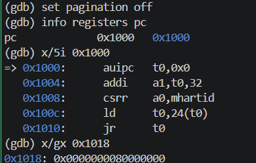
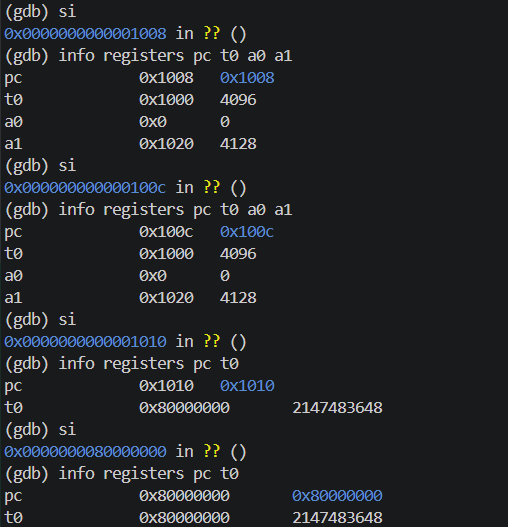

# 操作系统实验报告

## 实验基本信息

| 项目 | 内容 |
|------|------|
| 实验名称 | Lab 1：比麻雀更小的麻雀（最小可执行内核） |
| 小组成员 | 2413603 常侯鑫、2411834 张岩、2413404 邓耀飞 |
| 完成日期 | 2026-10-07 |
| 小组仓库 | https://github.com/cxdmnls/OS2026 |
| 提交分支 | lab1 |

### 小组分工

本实验采用全员独立实践的方式，不把两个练习拆分给不同成员。每位成员均需独立完成环境检查、源码阅读、内核构建与运行、GDB 启动流程跟踪和两个练习的解答，再共同核对实验现象及报告。

| 成员 | 负责的练习/模块 | 报告分工 |
|------|----------------|----------|
| 2413603 常侯鑫 | 独立完成练习1、练习2及完整构建运行流程 | 整理个人记录，参与整体逻辑、练习答案和测试证据的共同核对 |
| 2411834 张岩 | 独立完成练习1、练习2及完整构建运行流程 | 整理个人记录，参与整体逻辑、练习答案和测试证据的共同核对 |
| 2413404 邓耀飞 | 独立完成练习1、练习2及完整构建运行流程 | 整理个人记录，参与整体逻辑、练习答案和测试证据的共同核对 |

## 一、实验目的

实验1主要讲解最小可执行内核和启动流程。内核运行在能够模拟 64 位 RISC-V 计算机的 QEMU 中。为了正确启动内核，需要理解 QEMU 的启动流程、程序的内存布局，以及编译与链接过程。

具体目标如下：

1. 使用链接脚本描述内核各段的内存布局，明确内核入口地址。
2. 使用交叉编译工具链生成 RISC-V ELF 文件，并转换为二进制内核镜像。
3. 理解 MROM、OpenSBI 和内核之间的控制权交接，使用 QEMU 启动内核。
4. 使用 OpenSBI 服务构建字符输出及格式化输出，为后续内核调试提供支持。
5. 使用 GDB 观察复位指令、寄存器变化和内核入口，验证对启动过程的理解。

## 二、实验环境

### 开发与调试环境

| 项目 | 本次使用情况 |
|------|--------------|
| 宿主环境 | Windows，WSL2 Ubuntu 24.04 |
| 目标架构 | RISC-V 64 位，QEMU virt 机器 |
| 模拟器 | QEMU 4.1.1 |
| 固件 | QEMU 自带 OpenSBI v0.4，Runtime SBI Version 0.1 |
| 交叉编译器 | SiFive GCC-Metal 10.2.0-2020.12.8 |
| 调试器 | SiFive GDB-Metal 10.1.0-2020.12.7 |
| 构建与终端工具 | GNU make、binutils、tmux |
| 实验代码 | `../code/` |
| 运行与调试 | `make qemu`、`make debug`、`make gdb`，GDB 连接 localhost:1234 |

### AI 工具使用情况

| 成员 | AI 编程工具 | 底层模型 | 备注 |
|------|------------|---------|------|
| 2413603-常侯鑫 | Codex | GPT-6.1 sol | 辅助环境搭建、代码理解、调试指导和报告整理 |
| 2411834-张岩 | Codex | DeepSeek-V4.1-Flash | 辅助环境搭建、代码理解、调试指导和报告整理 |
| 2413404-邓耀飞 | Codex | GPT-6.1 sol | 辅助环境搭建、代码理解、调试指导和报告整理 |

## 三、实验整体逻辑分析

### 3.1 本章节的逻辑主线

本章解决“在没有现成操作系统运行时支持的情况下，如何让一个最小内核开始执行并输出信息”的问题。它将交叉编译、内存布局、固件初始化、入口汇编、C 语言初始化和 SBI 输出连接起来。

构建流程为：

```text
C/汇编源码 → RISC-V 目标文件 → 链接脚本控制布局的 ELF（bin/kernel）
→ objcopy 转换 → 二进制内核镜像（bin/ucore.img）
```

启动执行流程为：

```text
QEMU 预加载 OpenSBI 和内核镜像
→ CPU 从 0x1000 的 MROM 开始执行
→ 跳转至 0x80000000 的 OpenSBI
→ OpenSBI 初始化并移交控制权
→ 0x80200000 的 kern_entry
→ 初始化内核栈 → kern_init()
→ 清零 .bss → cprintf() 输出 → 无限循环
```

需要区分镜像加载与 CPU 跳转：本实验 Makefile 使用 `-device loader,file=bin/ucore.img,addr=0x80200000`，镜像由 QEMU 在 CPU 执行前放入内存。OpenSBI 初始化后进入内核；这里并不是 OpenSBI 在运行过程中从磁盘读取该镜像。

### 3.2 功能的逐步实现

1. **安排内存布局。** 链接脚本指定目标架构、入口符号和段布局，使生成的镜像与加载地址一致。
2. **准备 C 函数使用的栈。** 汇编入口把 sp 指向预留栈空间顶部，避免 C 函数沿用固件栈。
3. **初始化内核数据。** `kern_init` 通过 `memset(edata, 0, end - edata)` 清零零初始化数据区域。
4. **建立输出路径。** 将 OpenSBI 的单字符服务逐层封装为格式化输出。
5. **构建并启动。** 由 Makefile 编译、链接、转换镜像，再由 QEMU 启动。
6. **通过调试验证。** 使用断点和指令单步，把源码含义与实际 PC、sp 和反汇编对应起来。

### 3.3 核心文件与函数

| 文件/函数 | 核心作用 |
|-----------|----------|
| `tools/kernel.ld` | `OUTPUT_ARCH(riscv)`、`ENTRY(kern_entry)`、基地址 0x80200000；组织 .text/.rodata/.data/.sdata/.bss |
| `kern/init/entry.S` | 定义 kern_entry、bootstack、bootstacktop，建立内核栈并尾跳转 |
| `kern/mm/mmu.h`、`memlayout.h` | 定义页大小 4096 字节、栈页数2和栈大小8192字节 |
| `kern/init/init.c:kern_init` | 清零 .bss、打印启动信息，随后永久循环 |
| `kern/libs/stdio.c:cprintf/vcprintf` | 处理可变参数并调用格式化输出 |
| `libs/printfmt.c:vprintfmt` | 解析格式字符串，通过回调逐字符输出 |
| `kern/driver/console.c:cons_putc` | 将控制台字符输出转交 SBI |
| `libs/sbi.c:sbi_console_putchar/sbi_call` | 使用服务号和参数寄存器执行 ecall |
| `Makefile`、`tools/function.mk` | 收集源码、生成编译规则与调试目标 |

实际输出路径还包括 `vcprintf`：

```text
cprintf → vcprintf → vprintfmt → cputch
→ cons_putc → sbi_console_putchar → sbi_call/ecall → OpenSBI → 串口终端
```

OpenSBI 运行在 M 模式，内核运行在 S 模式。这里使用传统 SBI 字符输出接口，服务号1放入 a7，字符放入 a0，通过 ecall 请求固件服务，而不是直接调用宿主机 C 标准库的 printf。

## 四、实验内容与实现

### 练习1：理解内核启动中的程序入口操作

**负责人：** 全体成员各自完成并共同核对。

本实验已有的入口代码如下：

```asm
kern_entry:
    la sp, bootstacktop
    tail kern_init
```

#### 1. la sp, bootstacktop 的操作与目的

`la` 是加载地址的伪指令。该指令把 `bootstacktop` 对应的地址放入 sp，建立内核自己的栈指针。它不会把该地址处的数据读取到 sp，也不会在执行时动态分配栈空间。

栈由汇编中的 `.space KSTACKSIZE` 预留，`KSTACKSIZE = 2 × 4096 = 8192` 字节。栈所在区域以 `.align PGSHIFT` 按4096字节对齐；本份代码将它放在 .data 段。bootstack 指向预留空间起点，bootstacktop 指向其末端。

RISC-V 栈向低地址增长，因而从栈空间末端开始使用。C 函数保存寄存器、进行函数调用和存放部分局部数据时都可能访问栈。在进入 C 函数之前设置 sp，可以避免沿用 OpenSBI 的栈并为内核的函数调用提供有效空间。

本次观察到：

```text
bootstacktop             = 0x80203000
入口第一条指令执行前 sp = 0x8001bd80
执行第一条机器指令后 sp = 0x80203000
```

反汇编显示此处伪指令展开为：

```asm
0x80200000: auipc sp,0x3
0x80200004: mv    sp,sp
```

第一条以当前地址为基准，加上 `0x3 << 12`，得到 `0x80203000`。第二条是零偏移情况下的汇编显示形式，不再改变 sp。因此本次执行一次 si 后，sp 就已等于栈顶部；一般情况下应根据实际展开的全部指令判断 la 是否完成。

GDB 在 `0x80203000` 后显示 `<SBI_CONSOLE_PUTCHAR>`，是因为栈顶部符号与后续数据符号在本次布局中同址，不代表 sp 指向了函数。这里应以地址与 `p/x &bootstacktop` 的结果核对。

#### 2. tail kern_init 的操作与目的

`tail` 是尾调用伪指令，跳转到目标函数而不更新 ra，也不为本次跳转建立普通 call 的返回链接。执行流程直接转入 `kern_init`。

`kern_init` 被声明为 noreturn，完成启动输出后进入无限循环，所以不需要返回 kern_entry。已有代码明确具备有效栈，尾跳转便可将控制权交给 C 入口。

本次链接后的反汇编为：

```asm
0x80200008: j 0x8020000a <kern_init>
```

这是 tail 经链接松弛后显示的实际跳转形式。跳转后 PC 为 `0x8020000a`，sp 仍为 `0x80203000`。不能把伪指令名称当作固定机器指令序列，最终应以反汇编为准。

### 练习2：使用 GDB 验证启动流程

**负责人：** 全体成员各自完成并共同核对。

#### 调试准备

在代码目录构建和运行：

```bash
make
make qemu
```

进行启动调试时，退出普通运行实例，在两个终端或 tmux 窗格中分别执行：

```bash
# 窗格一：启动虚拟机，CPU 暂停等待调试
make debug

# 窗格二：加载内核符号并连接 QEMU
make gdb
```

`make debug` 的 `-S` 让 CPU 在开始执行前暂停，`-s` 打开1234端口的 GDB 服务。`make gdb` 加载 `bin/kernel` 的符号、选择 riscv:rv64 架构并连接 localhost:1234。因此能够在尚未执行复位指令时检查 CPU。

#### 阶段一：观察复位代码

执行：

```gdb
set pagination off
info registers pc
x/5i 0x1000
x/gx 0x1018
```

命令含义如下：

| 命令 | 作用 |
|------|------|
| set pagination off | 关闭分页，不再等待确认才能显示长输出 |
| info registers pc | 显示当前执行位置 |
| x/5i 0x1000 | 从0x1000开始反汇编5条指令 |
| x/gx 0x1018 | 将0x1018处8字节数据以十六进制显示 |
| si | 执行一条机器指令后暂停 |
| info registers pc t0 a0 a1 | 查看执行位置、临时寄存器和启动参数寄存器 |

实际结果为 `pc = 0x1000`，`0x1018` 处存储 `0x0000000080000000`。最初五条指令是：

| 地址 | 指令 | 功能 |
|------|------|------|
| 0x1000 | auipc t0,0x0 | 将当前指令地址0x1000作为基准放入t0 |
| 0x1004 | addi a1,t0,32 | 将a1设置为0x1020，指向复位代码附带的固件启动参数结构 |
| 0x1008 | csrr a0,mhartid | 读取hart编号并放入a0，本次为0 |
| 0x100c | ld t0,24(t0) | 从0x1018加载8字节跳转目标，t0变为0x80000000 |
| 0x1010 | jr t0 | 跳转至OpenSBI入口0x80000000 |

这些指令位于 QEMU virt 的 MROM 复位区域，不是内核入口，也不是 OpenSBI 本体。它们主要完成启动参数准备和固件入口跳转；更完整的机器态初始化由 OpenSBI 负责。`a1=0x1020` 在这一阶段指向固件动态启动信息，不应误认为内核启动时的设备树地址。

#### 阶段二：单步进入 OpenSBI

反复执行：

```gdb
si
info registers pc t0 a0 a1
```

截图中的关键变化如下：

| 暂停位置 PC | 观察到的状态 | 已完成的操作 |
|-------------|--------------|--------------|
| 0x1008 | t0=0x1000，a1=0x1020 | 已准备启动参数结构地址 |
| 0x100c | a0=0，a1=0x1020 | 已读取当前hart编号 |
| 0x1010 | t0=0x80000000 | 已加载固件入口地址，尚未执行跳转 |
| 0x80000000 | t0=0x80000000 | jr已执行，进入OpenSBI入口 |

因此判断“进入 OpenSBI”的直接证据是 PC 到达 `0x80000000`，而不只是 t0 中出现该地址。GDB 显示 `?? ()` 是因为本次加载的是内核符号，缺少相应固件符号，不代表执行失败。

#### 阶段三：到达内核入口

进入 OpenSBI 后，不再对固件的每条初始化指令逐条执行，而是在交接目标处设置硬件断点：

```gdb
hbreak *0x80200000
continue
info registers pc sp
x/6i $pc
p/x &bootstacktop
```

`hbreak` 设置硬件断点，避免通过改写目标指令设置软件断点；`continue` 让 CPU 运行到断点；`x/6i $pc` 展示当前PC起的6条机器指令；`p/x &bootstacktop` 查询栈顶部地址。

实际命中 `kern_entry`，停在 `entry.S` 第7行：

```text
pc = 0x80200000 <kern_entry>
sp = 0x8001bd80
bootstacktop = 0x80203000
```

断点暂停时，入口第一条指令还没有执行，因此 sp 仍为固件留下的值。该结果验证了内核第一条指令确实位于 `0x80200000`。

文档建议使用 `watch *0x80200000` 观察加载。本次没有监视点触发记录：当前镜像由 QEMU 在 CPU 启动前加载，之后设置监视点不一定能捕获这一事件。我们通过入口断点和实际指令确认交接，不把未观察到的加载事件写成实测结果。

#### 阶段四：验证栈和 C 入口

执行：

```gdb
si
info registers pc sp
hbreak kern_init
continue
info registers pc sp
continue
```

第一次 si 后，PC为 `0x80200004`，sp为 `0x80203000`。随后命中 kern_init，PC为 `0x8020000a`，sp保持 `0x80203000`。最后 continue，QEMU 输出启动字符串。

GDB 显示 `kern_init` 对应 `memset(edata, 0, end - edata)` 源码行，这是调试信息的行映射；此时函数尚未执行完整个初始化流程。源码的 -O2 优化以及伪指令展开使源码行与机器指令不一定一一对应，应结合PC与反汇编理解。

#### 练习2结论

本次模拟机器加电后最初执行的指令位于 `0x1000` 的 MROM，主要负责建立基地址、准备固件启动参数、读取hart编号、加载OpenSBI入口并跳转。随后 OpenSBI 初始化并移交控制权，CPU到达 `0x80200000` 的 kern_entry。入口设置内核栈后转入 kern_init，最终输出启动信息并进入无限循环。

这些地址是本次 QEMU virt 配置的实际观察，不是所有 RISC-V 芯片必须统一采用的复位地址。

### AI 协作与实际迭代过程

本实验没有待填代码函数，主要工作是运行已有最小骨架并解释启动流程。涉及的函数包括：

```c
int kern_init(void) __attribute__((noreturn));
int cprintf(const char *fmt, ...);
int vcprintf(const char *fmt, va_list ap);
void cons_putc(int c);
void sbi_console_putchar(unsigned char ch);
uint64_t sbi_call(uint64_t sbi_type, uint64_t arg0,
                  uint64_t arg1, uint64_t arg2);
```

## 五、测试与验证

### 验证结果

本报告根据已有代码、当前构建产物和四张实际截图整理。没有为了撰写报告重新启动或改变正在调试的内核。

| 验证项目 | 实际证据与结论 |
|----------|----------------|
| 构建产物 | 本地code/bin中存在kernel（48776字节）和ucore.img（12296字节）；已有运行证据，但图片未记录完整编译输出 |
| 内核运行 | make qemu截图出现OpenSBI v0.4和启动字符串，最小内核运行成功 |
| 复位地址 | GDB截图显示PC=0x1000，并反汇编出五条复位指令 |
| 固件入口 | stepPC截图显示PC从0x1010跳转至0x80000000 |
| 内核入口 | 硬件断点命中kern_entry，PC=0x80200000 |
| 内核栈 | sp由0x8001bd80变为0x80203000，与bootstacktop一致 |
| C入口 | 断点命中kern_init，PC=0x8020000a |
| 运行终态 | 启动字符串出现；源码最后为无限循环，continue后持续运行符合预期 |
| 自动评分 | 当前源码没有tools/grade.sh，没有make grade通过证据；以练习要求的运行和调试结果验证 |

本次产物大小、kern_init地址和栈地址与当前构建有关，换用工具链或修改源码后可能变化，不应当作为普遍固定值。

### 测试截图

**图1：QEMU启动及内核输出。** 专用终端中执行make qemu，显示OpenSBI v0.4和 `(THU.CST) os is loading ...`。


**图2：复位地址、指令与固件跳转目标。** 初始PC为0x1000，0x1018存储0x80000000。



**图3：复位指令单步与进入OpenSBI。** 展示a1、t0和PC的变化，最终PC为0x80000000。



**图4：OpenSBI交接、栈初始化、C入口及启动输出。** 展示kern_entry断点、bootstacktop、sp变化和kern_init断点。


四张截图覆盖核心运行和调试现象。模板还要求编译输出截图，目前缺少该项，提交前应补充实际构建输出；每位成员应独立复现并核对自己的记录，现有图片不代表三人的独立完成证明。

## 六、实验总结与收获

### 对操作系统的理解

| 本实验知识点 | 对应OS原理 | 含义、关系与差异 |
|--------------|-----------|----------------|
| MROM、OpenSBI与内核入口 | 系统引导与控制权交接 | CPU先执行固件再进入内核；本实验采用模拟器预加载，实际设备可能经存储驱动和引导程序加载 |
| 链接脚本与ELF/BIN | 程序布局、装载与重定位 | 链接器决定段与符号地址，加载地址须与镜像布局匹配；本实验裸二进制没有自描述入口头，依赖外部加载配置 |
| 栈指针、tail与C入口 | 执行上下文和调用约定 | 栈提供保存现场与函数调用空间；这是单一启动栈，尚不是多进程上下文切换 |
| .bss清零 | 程序运行时初始化 | 零初始化全局数据需要在裸机环境中显式处理，不能依赖宿主操作系统运行时；objcopy生成的BIN也不必包含整个.bss的零字节 |
| SBI与ecall | 特权级、异常和系统调用接口 | 内核以受控异常请求M模式固件服务；与用户态系统调用机制相似，但调用层次和服务对象不同 |
| cprintf逐层封装 | 设备接口与抽象层次 | 格式解析和字符输出分离，实现最基本的内核可观测性；尚未建立完整设备驱动框架 |
| GDB断点与单步 | 运行状态与源码验证 | 用实际PC、寄存器和反汇编验证控制流，弥补仅阅读源码无法确认的问题 |

本实验没有覆盖但操作系统原理中重要的内容包括：物理内存分配与虚拟内存页表、用户进程与调度、上下文切换、异常和中断处理框架、同步互斥、文件系统以及进程资源保护。最小内核只提供启动和输出，是后续实现这些功能的基础。

### AI 协作开发的经验

本次协作表明，应先明确版本、课程环境和交付要求，再执行工具配置。环境相近的课程可以复用WSL系统，但应通过独立工具目录和明确的激活入口减少误用。

对于调试命令，仅复制命令不足以完成理解。需要区分“查看状态”的info/x/p与“改变执行位置”的si/continue，并使用PC和寄存器数值判断CPU所处阶段。
